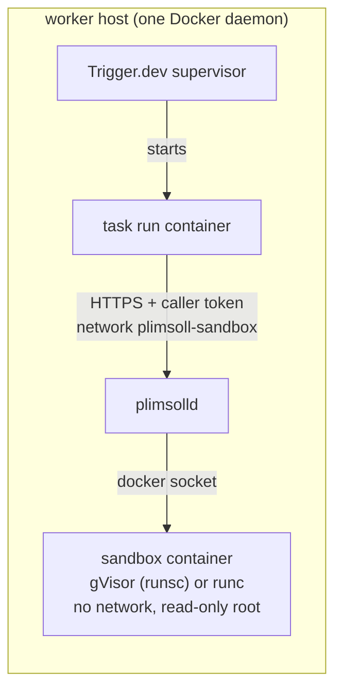

# plimsoll beside a self-hosted Trigger.dev worker

Trigger.dev's self-hosting security page says the self-hosted setup "is not designed to
run untrusted code or untrusted payloads"
([EXTERNAL · Trigger.dev docs ↗](https://trigger.dev/docs/self-hosting/security)).
Code an AI agent writes is untrusted code. This recipe runs that code in plimsoll
instead of in the task: plimsolld, plimsoll's daemon, runs on the worker host as one
more Compose service, and every task run reaches it at `https://plimsolld:8746` over a
private Docker network. The task sends the code; plimsolld runs it in a locked-down
sandbox container and returns the output with the isolation tier it ran behind.



## What was tested

On 2026-10-05, on one Linux machine (WSL2), with Trigger.dev v4.7.2 (webapp,
supervisor and CLI), plimsoll v0.19.0, Docker Engine 29.1.3 with the containerd image
store, and gVisor's `runsc` registered with `--host-uds=open`: the starter's
`deployed-cell-trial` task, deployed to the local instance, ran two Python cells in one
plimsoll session and returned `kernel` for both. The same run under runc returned
`container` when its floor allowed it, and was refused before any code ran when it did
not. One part of Trigger.dev's stack did not run: its compose file names
`electricsql/electric:1.2.4`, which Docker Hub did not serve that day, so the test ran
without the `electric` service (it backs the dashboard's live updates, which were not
checked; the trial polls the API instead).

## Prerequisites

- A Linux host running Trigger.dev's v4 worker from their Docker Compose setup
  ([EXTERNAL · Trigger.dev docs ↗](https://trigger.dev/docs/self-hosting/docker)), as a
  user who can run `docker`. plimsolld must run on the same host as the task runs: one
  plimsolld per worker host.
- Docker Engine 28.1 or later using the containerd image store
  ([EXTERNAL · Docker docs ↗](https://docs.docker.com/engine/storage/containerd/)).
  `setup.sh` refuses the classic store, because only the containerd store gives a
  locally built image a digest to pin it by.
- `openssl` and the `docker compose` plugin.
- For the kernel tier, gVisor registered with Docker by plimsoll's installer, which also
  sets the `--host-uds=open` flag plimsoll needs
  ([EXTERNAL · source repo ↗](https://github.com/plimsollmark/plimsoll/blob/v0.19.0/docker/install-gvisor.sh),
  [EXTERNAL · plimsoll docs ↗](https://github.com/plimsollmark/plimsoll/blob/v0.19.0/docs/gvisor.md)).
  Without it the recipe still works, at the container tier (see below).
- This repository cloned on the worker host, and Node.js 22.18 or later where you deploy.

plimsoll publishes no daemon binary or container image, so `setup.sh` builds them: it
builds plimsolld from the tagged Go module (checked against Go's checksum database and
a module hash pinned in `plimsolld.Dockerfile`), then builds the sandbox images from the
same module's `docker/` directory on a `node:22-alpine` pinned by digest. Every image
plimsolld uses is then named by digest in `.env`.

## Steps

**1. Prepare.** From the repository root:

```sh
./self-hosted/setup.sh
```

It picks gVisor when Docker has `runsc` registered and runc otherwise
(`PLIMSOLL_RUNTIME=runc` forces runc), builds the images, creates one plimsoll caller
named `trigger-worker`, makes a self-signed TLS certificate for the name `plimsolld`,
and writes `self-hosted/.env`. Everything it creates that is not code goes in
`self-hosted/state/`, which git ignores. The caller's token is written once, to
`self-hosted/state/caller-token` (mode 600); `clients.json` beside it holds only a hash.

plimsolld makes a Unix socket per run in a directory that must have the same path
inside and outside its container, and a socket path is limited to 107 bytes, so that
directory's path may be at most 60 characters. If your checkout's path is longer,
`setup.sh` stops and says so; give it a short directory you own:

```sh
sudo install -d -m 700 -o "$(id -u)" -g "$(id -g)" /var/lib/plimsoll-run
PLIMSOLL_RUN_DIR=/var/lib/plimsoll-run ./self-hosted/setup.sh
```

**2. Start plimsolld**, before the worker, because this creates the network the worker
joins:

```sh
cd self-hosted && docker compose up -d
```

Within a minute `docker compose ps` shows it `healthy`, and
`docker compose logs plimsolld` ends with a `plimsolld listening` line carrying
`"isolation":"kernel"` and `"tls":true` (with gVisor), after
`hardened mode: production policy verified and enforced`.

**3. Check it from the task network:**

```sh
./self-hosted/check.sh
```

This calls plimsolld the way a task will, from a throwaway container on the
`plimsoll-sandbox` network, trusting only its certificate, with the caller token. It
prints, with gVisor:

```json
{
  "sandbox": "docker",
  "isolation": "kernel",
  "supportsSessions": true,
  "sessionLanguages": ["javascript", "python"],
  "resources": { "memoryMb": 512, "cpus": 1, "pids": 256, "diskMb": 256 }
}
```

**4. Attach task runs to the network.** In your clone of Trigger.dev, in
`hosting/docker`, add this repository's override to the compose command you already
use, then recreate the supervisor. For the combined webapp and worker stack:

```sh
docker compose -f webapp/docker-compose.yml -f worker/docker-compose.yml \
  -f /path/to/plimsoll-trigger-starter/self-hosted/trigger-worker.override.yaml up -d
```

For a worker-only host, `-f worker/docker-compose.yml -f .../trigger-worker.override.yaml`.
The override sets the supervisor's `DOCKER_RUNNER_NETWORKS` to
`webapp,supervisor,plimsoll-sandbox`, the two networks Trigger.dev's file already names
plus this one.

**5. Configure the project.** In the Trigger.dev dashboard, in the environment you
deploy to, set:

| Variable | Value |
|---|---|
| `PLIMSOLL_URL` | `https://plimsolld:8746` |
| `PLIMSOLL_TOKEN` | the contents of `self-hosted/state/caller-token` |
| `PLIMSOLL_FLOOR` | only under runc: `container` (see below) |

Then keep the token in your secret manager. The file is needed again only by
`check.sh`.

**6. Deploy** from this repository's root, on the worker host or any machine whose
checkout has `self-hosted/state/tls/cert.pem` (copy it; it is not secret). Follow
Trigger.dev's CLI login for self-hosting, set `TRIGGER_PROJECT_REF` as in the main
README's Deploy section, then:

```sh
npm ci
npm run deploy
```

When that certificate file exists, `trigger.config.ts` copies it into the task image
and sets the image's `NODE_EXTRA_CA_CERTS` to it, so the tasks trust plimsolld's
certificate in addition to the usual public roots. Setting `NODE_EXTRA_CA_CERTS` in the
dashboard does not work: in our test the image's own empty value replaced it, and so
did setting `build.extraCACerts` in the config.

**7. Run the trial**, which makes no AI call: it sends two fixed Python cells.

```sh
TRIGGER_API_URL=https://your-trigger-webapp TRIGGER_SECRET_KEY=tr_prod_... npm run trial
```

The test's output, with gVisor:

```json
{
  "runId": "run_cmuvidr9o000q5clasywpg6yt",
  "output": {
    "daemon": { "sandbox": "docker", "isolation": "kernel" },
    "floor": "kernel",
    "first": { "stdout": "3\n", "isolation": "kernel", "recordSha256": "3b010bea…" },
    "second": { "stdout": "10\n", "isolation": "kernel", "recordSha256": "a2763509…" },
    "interpreterReused": true
  }
}
```

`3` then `10` means the second cell saw the variable the first one defined, in the same
interpreter inside one sandbox. plimsolld's log shows the same calls from its side:
`session opened`, two `code run` lines with `"op":"cell"`, `"caller":"trigger-worker"`
and `"isolation":"kernel"`, then `session closed`. Leave `TRIGGER_API_URL` set: without
it the SDK sends the key to Trigger.dev's cloud.

## The isolation tier, and why

| Host | Tier reported | What it means |
|---|---|---|
| gVisor (`runsc`) registered | `kernel` | The generated code's system calls are handled by gVisor's own kernel in user space, not by the host's. plimsolld starts in hardened mode, which refuses to serve unless the tier is kernel or vm, every image is pinned, TLS is on, and per-caller limits are set. |
| no gVisor (`runc`) | `container` | The code shares the host's kernel, behind namespaces, a seccomp filter, no network, a read-only root and dropped capabilities. A kernel exploit escapes it. Hardened mode is off, because it requires kernel or vm. |

The tasks refuse anything below the kernel tier unless `PLIMSOLL_FLOOR` says otherwise,
and the refusal happens before any code runs. Under runc the trial therefore fails with
`sandbox isolation requirement not met: provider isolation container is below requested
minimum kernel`, which is the intended result. Set `PLIMSOLL_FLOOR=container` only for
code you would run on that host yourself.

A reported tier is plimsoll's configuration plus behavioral checks it runs at startup:
for docker, that the runtime is registered, and, from inside a throwaway sandbox under
that runtime, that the root filesystem is read-only, that the only writable places are
the promised size-limited mounts, that loopback is the only network interface, and that
the process limit is in force. It is not attestation, which is cryptographic proof from
hardware of what software is running
([EXTERNAL · plimsoll docs ↗](https://github.com/plimsollmark/plimsoll/blob/v0.19.0/docs/isolation-tiers.md)).

## What failure looks like

| Symptom | Cause |
|---|---|
| plimsolld keeps restarting; its log says `sandbox provider is not ready; refusing to serve` with a reason | A startup check failed. The reason names it, for example `bind: invalid argument` for a run directory path over 60 characters. |
| `check.sh` prints `Describe answered HTTP 401` and `invalid or expired token` | The token is not the one in `clients.json`. |
| The run fails with `fetch failed`, cause `ENOTFOUND` | The run container is not on `plimsoll-sandbox`: step 4's override is missing or the supervisor was not recreated. |
| The run fails with `fetch failed`, cause `self-signed certificate` | The deployed image does not carry the certificate: deploy from a checkout that has `self-hosted/state/tls/cert.pem`. |
| The run fails with `sandbox isolation requirement not met` | The daemon's tier is below the task's floor. Nothing ran. |
| `trigger deploy` fails at the indexer with `Failed to fetch environment variables: Connection error` | The image build reaches the webapp as `host.docker.internal`, which the CLI maps to the host's network address, not loopback; a webapp published only on `127.0.0.1` cannot be reached that way. |

## Limits

- **plimsolld is trusted infrastructure.** It holds the host's Docker socket, which is
  equivalent to root on that host, so anyone who takes over plimsolld owns the host. The
  sandbox boundary is between the generated code and the host; plimsolld sits on the
  host's side of it. Trigger.dev's supervisor reaches Docker through a socket proxy that
  limits the API; plimsoll refuses a daemon reached over TCP, because its per-run
  sockets and its cleanup assume the local daemon, and it needs container exec for
  sessions, which that proxy does not allow, so it gets the socket itself. Under gVisor
  it also runs in the host's process and cgroup namespaces (`compose.runsc.yaml`), to
  read the sandbox's process limit from the host; that adds nothing beyond the socket.
- **One token for the whole worker.** Every run container on the worker joins
  `plimsoll-sandbox`, because the supervisor's network setting is worker-wide, so any
  task on the worker can reach plimsolld; the token is what admits it. plimsoll sees one
  caller, `trigger-worker`. For a caller per project, add callers with `plimsoll-clients`
  ([EXTERNAL · plimsoll docs ↗](https://github.com/plimsollmark/plimsoll/blob/v0.19.0/docs/callers.md))
  and give each project its own token.
- **The token is printed in each run's container log.** Trigger.dev v4.7.2's run
  controller logs the run's environment variables, `PLIMSOLL_TOKEN` included, in its
  `[execution] started attempt` line on the run container's stdout. We reproduced this
  ([EXTERNAL · Trigger.dev GitHub issue ↗](https://github.com/triggerdotdev/trigger.dev/issues/3566));
  in the same test the token was not in Trigger.dev's Postgres or ClickHouse. Anyone who
  can read Docker logs on the host, or wherever those logs are shipped, can read it.
  Rotate it with `plimsoll-clients rotate` if logs leave the host.
- **Sessions hold memory.** On docker a suspended session is a paused container that
  keeps its memory and its concurrency slot. The defaults (512 MiB per run, 2 GiB for
  all runs, at most four at once, three sessions) are sized so a session never takes
  the last slot; set them for your host in `.env` with the variable names in
  `compose.yaml`. A session's files are bounded only after each call, not during it
  ([EXTERNAL · plimsoll docs ↗](https://github.com/plimsollmark/plimsoll/blob/v0.19.0/docs/sessions.md)).
- **Builds are local.** The Python image's Alpine packages are constrained to a minor
  version, not pinned, so two builds on different days can differ; the image digest in
  `.env` names what you built, and plimsoll states that identity on every run.
- **The certificate is self-signed for one name and lasts 365 days.** To renew it,
  delete `self-hosted/state/tls`, re-run `setup.sh`, recreate plimsolld and redeploy the
  tasks.
- **Not tested here:** several worker hosts, Docker Desktop or macOS (gVisor is
  Linux-only), and load. There is no VM tier in this recipe; plimsoll's VM providers are
  hosted services billed per second, and they do not keep sessions.
